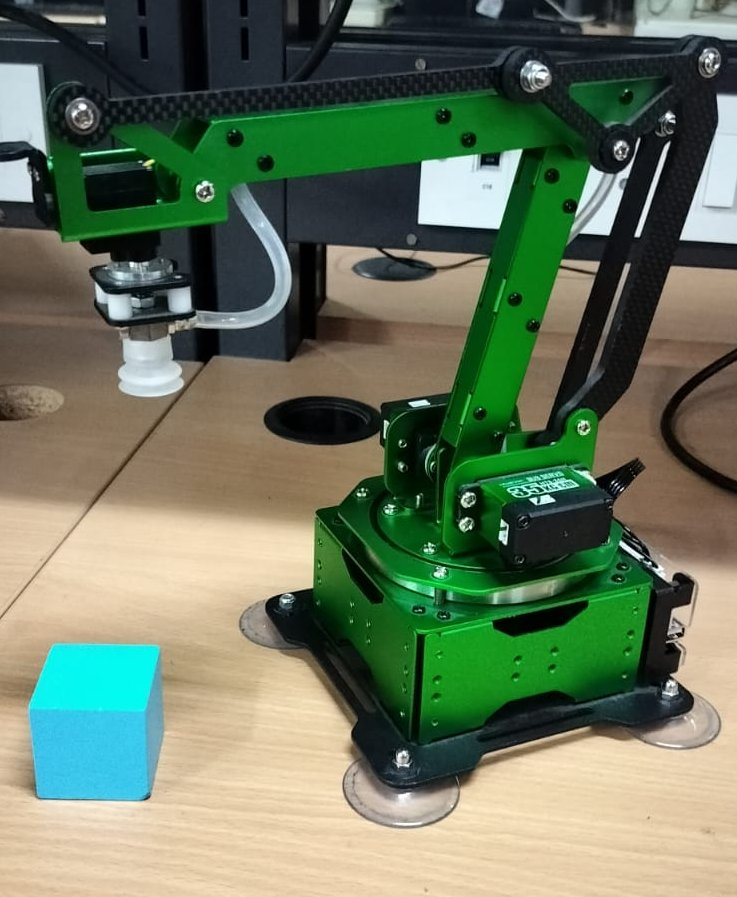

# RoboticArm  
A 3-DOF Robotic Arm Powered by ESP32

This repository contains the design and implementation of a **3 Degrees of Freedom (DOF) robotic arm** controlled using an **ESP32 microcontroller**.  
The robotic arm uses a **stepper motor** for base rotation and **two servo motors** for shoulder and elbow motion, enabling basic manipulation tasks such as picking, placing, and small object handling.

  

---

## 🦾 Project Overview

The robotic arm is built using a combination of **ESP32 control**, **stepper motor precision**, and **servo-based articulation**.  
It serves as an accessible, low-cost platform for learning robotic motion, kinematics, and control algorithms.

---

## 🔧 Components Used

### **1. ESP32 Microcontroller**
- Acts as the central controller  
- Handles all motion commands and joint coordination  
- Provides **Wi-Fi/Bluetooth** for wireless control  
- Supports programming via **Arduino IDE** or **ESP-IDF**

### **2. Stepper Motor (Base Rotation)**
- Controls horizontal rotation of the arm  
- Enables precise angular movement  
- Driven using an **A4988** or similar stepper driver  

### **3. Servo Motors (Shoulder & Elbow)**
- Two servos provide vertical arm articulation  
- **Servo 1:** Shoulder joint (lower arm)  
- **Servo 2:** Elbow joint (upper arm)  

### **4. Power Supply**
- Powers ESP32 + stepper + servos  
- Requires stable current to avoid servo jitter or brown-outs  

### **5. Structural Components**
- Base plate  
- Lower & upper arm segments  
- Joints + motor mounts  
- Fabricated using **aluminum**, **acrylic**, or **3D-printed parts**

---

## 🛠 Methodology

### **1. Hardware Setup**
- Assemble arm frame and joints  
- Mount stepper motor at base  
- Mount both servos at shoulder and elbow joints  
- Connect:
  - Stepper → A4988 driver → ESP32  
  - Servos → PWM pins of ESP32  
- Ensure stable power distribution  

---

### **2. ESP32 Programming**
- Programmed using **Arduino IDE** or **ESP-IDF**  
- Includes:
  - Stepper control library  
  - Servo control library  
  - Joint angle computation  
  - Remote command interface  
- Supports:
  - Serial commands  
  - Web dashboard  
  - Bluetooth control (optional)  

---

### **3. Control Algorithms**
- **Inverse Kinematics (IK)** implemented for 2-link planar movement  
- Calculates joint angles based on desired end-effector coordinates  
- Stepper motor provides base angle; servos provide vertical articulation  
- Implements:
  - Joint synchronization  
  - Speed control  
  - Smooth movement  

---

### **4. Path Planning**
- **Forward Kinematics (FK)** to determine the end-effector pose  
- **Inverse Kinematics (IK)** to compute joint angles  
- **Trajectory generation**:
  - Linear interpolation for straight-line motion  
  - Optionally Bézier or spline-based smooth trajectories  
- Ensures fluid arm motion without abrupt jumps  

---

